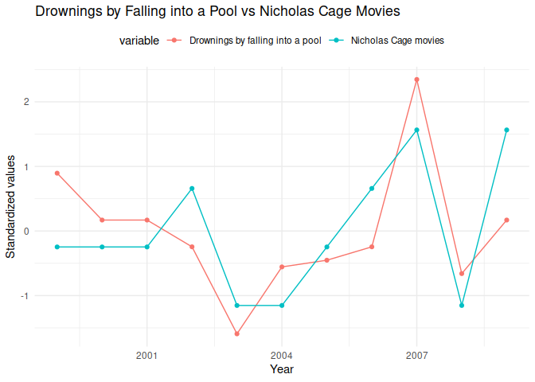

<!-- README.md is generated from README.Rmd. Please edit that file -->

# Spurious correlations

<!-- badges: start -->

<!-- badges: end -->

The goal of spuriouscorrelations is to keep alive the amazing examples
from [Tyler
Vigen](https://web.archive.org/web/20230607181247/https://tylervigen.com/spurious-correlations).
Unfortunately, as of 2023-10-09, the website is down as my students
noticed. Therefore, I decided to use the snapshot from the Internet
Wayback Machine to save the datasets from 2023-06-07.

## Installation

You can install the development version of spuriouscorrelations like so:

``` r
remotes::install_github("pachadotdev/spuriouscorrelations")
```

## Example

This is a basic example which shows you how to plot a spurious
correlation:

``` r
library(dplyr)
#> 
#> Attaching package: 'dplyr'
#> The following objects are masked from 'package:stats':
#> 
#>     filter, lag
#> The following objects are masked from 'package:base':
#> 
#>     intersect, setdiff, setequal, union
library(ggplot2)
library(spuriouscorrelations)

unique(spurious_correlations$var2_short)
#>  [1] US spending on science           Nicholas Cage                   
#>  [3] Cheese consumed                  Age of Miss America             
#>  [5] Arcade revenue                   Space launches                  
#>  [7] Mozzarella cheese consumption    Kentucky marriages              
#>  [9] US crude oil imports from Norway Chicken consumption             
#> [11] Nuclear power plants             Japanese cars sold              
#> [13] Spelling bee letters             Uranium stored                  
#> 14 Levels: Age of Miss America Arcade revenue ... US spending on science

nicholas_cage <- spurious_correlations %>%
  filter(var2_short == "Nicholas Cage")

ggplot(nicholas_cage) +
  geom_point(aes(x = var1_value, y = var2_value, color = year), size = 4) +
  theme_minimal() +
  labs(
    x = unique(nicholas_cage$var1_short),
    y = unique(nicholas_cage$var2_short),
    title = paste(unique(nicholas_cage$var1), "vs", unique(nicholas_cage$var2))
  )
```


The correlation is:

``` r
cor(nicholas_cage$var1_value, nicholas_cage$var2_value)
#> [1] 0.6660043
```

Now let’s make it double-axis:

``` r
library(tidyr)

nicholas_cage_long <- nicholas_cage %>%
  select(year, var1_value, var2_value) %>%
  pivot_longer(
    cols = c(var1_value, var2_value),
    names_to = "variable",
    values_to = "value"
  ) %>%
  # standardize the values
  group_by(variable) %>%
  mutate(value = (value - mean(value)) / sd(value))

# make a double y axis plot with year on the x axis
ggplot(nicholas_cage_long, aes(
  x = year, y = value, color = variable,
  group = variable
)) +
  geom_line() +
  geom_point() +
  scale_y_continuous(
    name = "Falling into a Pool",
    sec.axis = sec_axis(~.,
      name = "Nicholas Cage movies"
    )
  ) +
  theme_minimal() +
  labs(
    x = "Year",
    title = "Nicholas Cage vs. Drownings by Falling into a Pool",
    subtitle = "Standardized values"
  )
```


